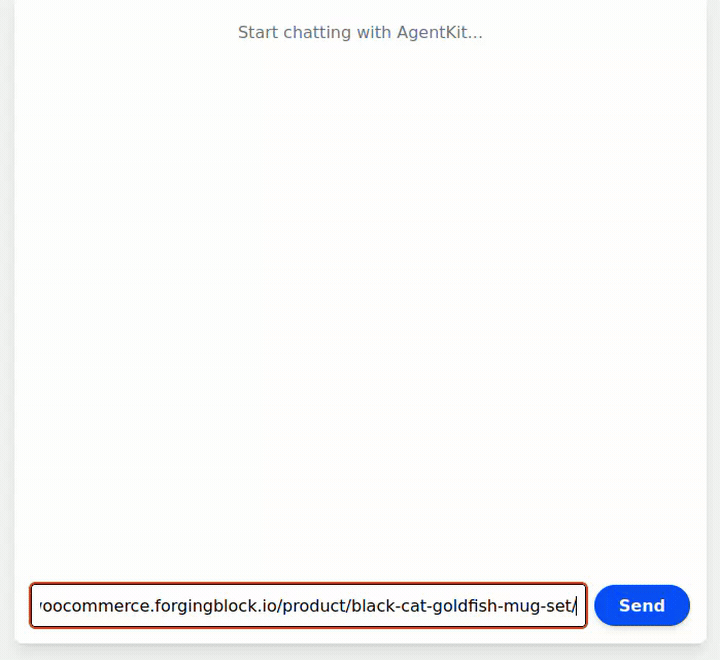

# ForgingBlock AI Payment Agent

This repository demonstrates how to build an **AI-powered crypto payment agent** using:

* **ForgingBlock payment APIs**
* **Coinbase AgentKit**
* **Privy embedded wallets**
* **OpenAI models**

The agent can:

* create orders
* resolve checkout links into blockchain transactions
* execute payments
* verify payment status
* search and interact with WooCommerce store catalogs

This project is a **reference implementation** showing how AI agents can interact with:

* ForgingBlock crypto payment infrastructure
* WooCommerce agent-compatible APIs
  - requires [plugin install](https://github.com/forgingblock/forgingblock-woocommerce-ai) on WooCommerce instance

---

## Quick Demo

#### Create Order


#### AI Payment Flow


#### WooCommerce AI Agent Search Store Catalog


#### WooCommerce AI Agent Buy



---

# Installation

Clone the repository:

```sh
git clone https://github.com/forgingblock/forgingblock-agentkit.git
cd forgingblock-agentkit
```

Install dependencies:

```sh
npm install
```

---

# Environment Setup

Create a `.env` file in the project root.

Example:

```env
OPENAI_API_KEY=

PRIVY_APP_ID=
PRIVY_APP_SECRET=

FB_API_KEY=

NETWORK_ID=base-mainnet
```

## OPENAI_API_KEY

API key used for the AI model.

## PRIVY_APP_ID

## PRIVY_APP_SECRET

Credentials for **Privy embedded wallets**.

You could create in [Privy dashboard](https://dashboard.privy.io/):

## FB_API_KEY (optional)

Merchant API key used to create orders.

Create an API key in the [dashboard](https://dash.forgingblock.io):

**Dashboard → Account Settings → Integrations → API Token**

If this variable is **not defined**, the agent can still perform payments but cannot create orders.

## NETWORK_ID

Network used by the wallet provider.

Example:

```
NETWORK_ID=base-mainnet
```

# Run the Development Server

Start the development server:

```sh
npm run dev
```

Open the application:

```
http://localhost:3000
```

---

# Architecture Overview

```
User / AI Agent
        │
        ▼
Next.js Agent API (/api/agent)
        │
        ├───────────────┬────────────────────────┬──────────────────────┐
        ▼               ▼                        ▼                      ▼
Woo Tools        Payment Tools            Wallet Execution       LLM Reasoning
        │               │                        │                      │
        ▼               ▼                        ▼                      ▼
Woo REST API     ForgingBlock API         ERC20 Transfer         Local Filtering
        │               │                        │                      │
        ▼               ▼                        ▼                      ▼
Woo Store        Invoice + Routes         Blockchain Tx          Ranked Results
```

---

# Hybrid Execution Model

```
User Input
   │
   ├── WooCommerce URL ───────────────┐
   │                                 ▼
   │                         woo_prepare_checkout
   │                                 │
   │                                 ▼
   │                         create_payment
   │                                 │
   │                                 ▼
   │                         Store Payment State
   │                                 │
   │                                 ▼
   │                         Execute / Confirm
   │
   ├── Simple Search ────────────────┐
   │                                 ▼
   │                         woo_search_products
   │
   └── Advanced Query ───────────────┐
                                     ▼
                              Fetch catalog
                                     │
                                     ▼
                              Local filtering (JS / LLM)
```

---

# WooCommerce Agent API

All endpoints are exposed via WordPress REST:

```
/wp-json/forgingblock/v1/agent/*
```

## Endpoints

### List / Search Products

```
GET /wp-json/forgingblock/v1/agent/products
GET /wp-json/forgingblock/v1/agent/products?q=search&page=1
```

---

### Get Product

```
GET /wp-json/forgingblock/v1/agent/products/{id}
```

---

### Create Order

```
POST /wp-json/forgingblock/v1/agent/create-order
```

```json
{
  "product_id": 123,
  "quantity": 1
}
```

---

### Create Checkout

```
POST /wp-json/forgingblock/v1/agent/checkout
```

```json
{
  "order_id": 123,
  "order_key": "wc_order_xxx"
}
```

---

# OpenAI / Claude Tool Schema

Example tool definitions for agent integration:

```json
{
  "name": "woo_search_products",
  "description": "Search WooCommerce products",
  "parameters": {
    "type": "object",
    "properties": {
      "base": { "type": "string" },
      "query": { "type": "string" },
      "page": { "type": "number" }
    },
    "required": ["base"]
  }
}
```

```json
{
  "name": "woo_prepare_checkout",
  "description": "Prepare WooCommerce checkout",
  "parameters": {
    "type": "object",
    "properties": {
      "base": { "type": "string" },
      "url": { "type": "string" },
      "product_id": { "type": "number" },
      "quantity": { "type": "number" }
    }
  }
}
```

```json
{
  "name": "create_payment",
  "description": "Generate payment details",
  "parameters": {
    "type": "object",
    "properties": {
      "invoice_url": { "type": "string" }
    },
    "required": ["invoice_url"]
  }
}
```

---

# Agent Prompt Specification

## Intent Routing Rules

### Search

If user intent is:

```
find / search / browse / list
```

→ MUST call:

```
woo_search_products
```

---

### Checkout

Only call:

```
woo_prepare_checkout
```

when:

* product URL provided
* product_id provided
* explicit "buy" intent

---

### Advanced Queries

If user asks:

```
cheaper than
under price
best / cheapest
```

→ DO NOT rely on Woo API

→ Fetch catalog and filter locally

---

### Payment

Always:

```
create_payment → confirm → transfer → verify
```

---

# Payment Flow

```
create_payment → confirm → ERC20 transfer → verify_payment
```

---

# Wallet Execution

```
ERC20ActionProvider_transfer
```

---

# Available Agent Actions

## Payments

* create_order
* create_payment
* verify_payment

---

## WooCommerce

* woo_search_products
* woo_get_product
* woo_prepare_checkout
* detect_woocommerce_capabilities

---

# Example Flow

```
find mugs
→ list products
→ select product
→ checkout
→ confirm
→ pay
→ verify
```

---

# Chat Session Storage

In-memory. Use Redis in production.

---

# Production Improvements

### Search

* fuzzy matching
* ranking
* embeddings

---

### Payments

* webhook handling
* retries
* persistence

---

### Agent UX

* multi-turn selection
* "buy first result"
* structured UI output

---

# Disclaimer

This repository is an **example implementation** demonstrating how AI agents can integrate with the ForgingBlock payment infrastructure.

It is intended for experimentation and developer reference.

Production deployments should include additional security, validation, and persistence layers.
