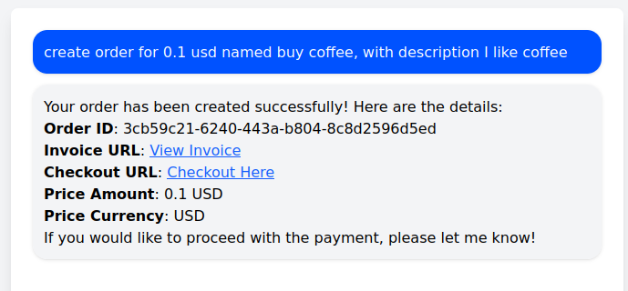

# ForgingBlock AI Payment Agent

This repository demonstrates how to build an **AI-powered crypto payment agent** using:

* **ForgingBlock payment APIs**
* **Coinbase AgentKit**
* **Privy embedded wallets**
* **OpenAI models**

The agent can:

* create orders
* resolve checkout links into blockchain transactions
* execute payments
* verify payment status

This project is a **reference implementation** showing how AI agents can interact with ForgingBlock crypto payment infrastructure.

## Quick Demo

### Create Order



### AI Payment Flow


# Installation

Clone the repository:

```sh
git clone https://github.com/forgingblock/forgingblock-agentkit.git
cd forgingblock-agentkit
```

Install dependencies:

```sh
npm install
```

# Environment Setup

Create a `.env` file in the project root.

Example:

```env
OPENAI_API_KEY=

PRIVY_APP_ID=
PRIVY_APP_SECRET=

FB_API_KEY=

NETWORK_ID=base-mainnet
```

## OPENAI_API_KEY

API key used for the AI model.

## PRIVY_APP_ID

## PRIVY_APP_SECRET

Credentials for **Privy embedded wallets**.

You could create in [Privy dashboard](https://dashboard.privy.io/):

## FB_API_KEY (optional)

Merchant API key used to create orders.

Create an API key in the [dashboard](https://dash.forgingblock.io):

**Dashboard → Account Settings → Integrations → API Token**

If this variable is **not defined**, the agent can still perform payments but cannot create orders.

## NETWORK_ID

Network used by the wallet provider.

Example:

```
NETWORK_ID=base-mainnet
```

# Run the Development Server

Start the development server:

```sh
npm run dev
```

Open the application:

```
http://localhost:3000
```

# Architecture Overview

```
User / AI Agent
        │
        ▼
Next.js Agent API
(app/api/agent)
        │
        ▼
AgentKit Tools
(create_order / create_payment / verify_payment)
        │
        ▼
ForgingBlock API
(api.forgingblock.io)
        │
        ▼
Blockchain (Base / EVM networks)
```

Wallet execution is handled through an **AgentKit wallet provider**.

---

# Wallet Support

This example uses **Privy embedded wallets** for simplicity and quick testing.

Privy provides:

* email authentication
* embedded EVM wallets
* secure key management
* easy AgentKit integration

However, **Privy is not required**.

The stack is built on **Coinbase AgentKit**, which supports multiple wallet providers.

Supported examples include:

* Privy embedded wallets
* Coinbase Wallet
* WalletConnect
* private-key wallets
* custom wallet providers

Because the wallet layer is abstracted through the AgentKit `WalletProvider`, you can replace Privy without modifying the payment agent logic.

Privy is used here purely as a **convenient example wallet provider**.

# System Prompt Behavior

The agent operates with a structured system prompt enforcing safe payment execution.

### Payment Resolution

When a user provides a checkout URL or checkout ID:

```
https://api.forgingblock.io/api/v1/checkout?id=<checkout_id>
```

the agent must call:

```
create_payment
```

The agent **never constructs payment instructions manually**.

---

### Payment Confirmation

After resolving a checkout, the agent shows:

```
Invoice URL
Invoice ID
Network
Token
Amount
Payment Address
```

The user must confirm before the transaction is executed.

Examples:

```
confirm
confirm payment
pay now
execute payment
```

---

### Transaction Execution

After confirmation the agent:

1. switches the wallet network
2. executes the transaction
3. waits for the transaction hash
4. verifies payment status

---

### Transaction Rules

The agent must use the transaction returned by the API:

```
recommendedTx
```

ERC-20 transfers are encoded in the transaction `data` field.

The agent **must not recompute token transfers**.

---

### Payment Verification

After sending the transaction:

```
verify_payment
```

A payment is successful when:

```
status = completed
```

---

# Available Agent Actions

---

# create_order

Creates a new payment order.

Requires:

```
FB_API_KEY
```

If the API key is not defined, this action is not available.

### Parameters

```
price_amount
price_currency
title (optional)
description (optional)
```

### Example

```
create_order(
  price_amount=25,
  price_currency="USD",
  title="T-shirt purchase"
)
```

### Returns

```
checkout_url
checkout_id
invoice_url
order_id
```

---

# create_payment

Resolves a checkout URL or checkout ID into blockchain payment instructions.

Available **without API key**.

### Input

```
checkout URL
or
checkout ID
```

Example:

```
create_payment(
  url="https://api.forgingblock.io/api/v1/checkout?id=..."
)
```

### Returns

```
invoiceId
invoiceUrl
network
token
amount
paymentAddress
recommendedTx
verifyUrl
```

`recommendedTx` contains the exact transaction required to perform the payment.

---

# verify_payment

Checks the status of an invoice.

Available **without API key**.

### Input

```
invoiceId
```

### Returns

```
status
cryptoAmount
crypto_underpaid_amount
crypto_overpaid_amount
```

Example statuses:

```
new
partially_paid
completed
expired
```

---

# Example Flow — Merchant

Merchant creates an order.

```
create_order
```

Example request:

```
Create a $25 USD order for a T-shirt
```

Response:

```
checkout_url
```

Example checkout link:

```
https://api.forgingblock.io/api/v1/checkout?id=1234...
```

The merchant shares this link with a customer.

---

# Example Flow — AI Payment Agent

User provides a checkout:

```
Pay this checkout
https://api.forgingblock.io/api/v1/checkout?id=...
```

Agent calls:

```
create_payment
```

Agent shows payment details:

```
Invoice URL
Invoice ID
Network
Token
Amount
Payment Address
```

User confirms:

```
confirm payment
```

Agent executes:

```
wallet_switchNetwork
wallet_sendTransaction
```

Then verifies:

```
verify_payment
```

Final result:

```
Payment completed
```

---

# Chat Session Storage

This example stores chat sessions **in memory** for 20 minutes (order is fixed 20-minute lifetime).

This is suitable only for development.

Production deployments should store sessions in:

For production deployments, sessions should be stored in a persistent datastore such as:

- **Redis**
- **PostgreSQL**

This ensures:

* persistent conversations
* multi-instance deployments
* reliable payment flows

---

# Production Improvements

This project can be extended with:

### Persistent Session Storage

- **Redis**
- **PostgreSQL**

### Payment Webhooks

API Reference [Webhook callback](https://forgingblock.readme.io/reference/payment-callback) section:

Handle events such as:
invoice `completed`
invoice `partially_paid`

---

# Disclaimer

This repository is an **example implementation** demonstrating how AI agents can integrate with the ForgingBlock payment infrastructure.

It is intended for experimentation and developer reference.

Production deployments should include additional security, validation, and persistence layers.
